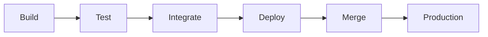

# GitOps Workflow: Build → Test → Integrate → Deploy → Merge

This repository implements a comprehensive GitOps workflow that ensures **zero service disruption** and **feature loss prevention** through automated testing and deployment.

## 🎯 Workflow Overview



## 🛡️ Branch Protection

- **Direct pushes to `main` are PROHIBITED**
- **All changes must come from merged branches**
- **Pull requests require all checks to pass**
- **Manual approval required for production merges**

## 🚀 Environments

- Staging: single-user, dev wallet (your Telegram ID), mainnet. Service: `telegram-service-stg`. Secrets: `*-stg`.
- Production: multi-user, high-performance, separate bot identity. Service: `telegram-service`. Secrets: `*-prod`.

Promotion: main → auto deploy to staging (smoke tests) → manual promotion to production with `./deploy_telegram.sh`.

## 🚀 Development Workflow

### Quick Command (Recommended)

```bash
# Make your changes, then run:
./dev-workflow.sh "Your commit message"
```

This single command will:
1. ✅ **Build** - Compile and validate code
2. ✅ **Test** - Run unit and integration tests  
3. ✅ **Integrate** - Validate module compatibility
4. ✅ **Commit** - Save changes with message
5. ✅ **Push** - Send to remote branch
6. ✅ **Trigger CI/CD** - Start automated pipeline

### Manual Workflow

```bash
# 1. Create feature branch
git checkout -b feature/your-feature

# 2. Make changes
vim telegram_service/server.py

# 3. Test locally
./test.sh

# 4. Commit and push
git add .
git commit -m "Add new feature"
git push origin feature/your-feature

# 5. Create Pull Request
# 6. Wait for CI/CD pipeline
# 7. Review and approve
# 8. Merge to main
```

## 🔄 CI/CD Pipeline Phases

### 1. 🔨 Build Phase
- **Python compilation** - Syntax validation
- **Node.js validation** - Executor syntax check
- **Dependency installation** - All requirements
- **Module compilation** - Bytecode generation

### 2. 🧪 Test Phase
- **Unit tests** - Core functionality
- **Emoji pattern tests** - UI consistency
- **System health tests** - Production readiness
- **Coverage reporting** - Code quality metrics

### 3. 🔗 Integration Phase
- **Module imports** - Dependency validation
- **Function signatures** - API compatibility
- **Error handling** - Graceful failure testing
- **Cross-module communication** - System integration

### 4. 🚀 Deploy Phase
- **Staging deployment** - Safe environment testing
- **Health checks** - Service availability
- **Database validation** - Data integrity
- **API endpoint testing** - External interface

### 5. 🔀 Merge Phase
- **Branch protection** - Security validation
- **Status checks** - All phases must pass
- **Manual approval** - Human oversight
- **Production readiness** - Final validation

## 🛠️ Auto-Fix Capabilities

The system automatically fixes common issues:

- **Code formatting** - Black formatter
- **Import sorting** - isort
- **Linting issues** - flake8
- **Test formatting** - Consistent test structure
- **Re-run pipeline** - After fixes applied

## 📊 Monitoring & Alerts

### Success Indicators
- ✅ All pipeline phases pass
- ✅ Tests run in < 2 minutes
- ✅ Zero service disruption
- ✅ Feature functionality preserved

### Failure Handling
- ❌ **Immediate feedback** - Failed tests block merge
- 🔧 **Auto-fix attempts** - Common issues resolved automatically
- 📋 **Detailed logs** - Clear error reporting
- 🔄 **Re-run capability** - Easy retry after fixes

## 🎯 Best Practices

### For Developers
1. **Always use feature branches** - Never commit directly to main
2. **Run tests locally first** - Use `./dev-workflow.sh`
3. **Write descriptive commits** - Clear change documentation
4. **Review PRs carefully** - Ensure quality before merge
5. **Monitor CI/CD status** - Watch for failures

### For Production
1. **Manual approval required** - Human oversight for main merges
2. **Staging validation** - Test in safe environment first
3. **Rollback capability** - Quick revert if issues arise
4. **Health monitoring** - Continuous service validation
5. **Zero-downtime deployment** - Seamless updates

## 🔧 Configuration

### Branch Protection Rules
```yaml
# Required in GitHub Settings → Branches
- Require pull request reviews: ✅
- Require status checks: ✅
- Require branches to be up to date: ✅
- Require linear history: ✅
- Restrict pushes: ✅
- Require conversation resolution: ✅
```

### Required Status Checks
- `Build` phase must pass
- `Test` phase must pass  
- `Integrate` phase must pass
- `Deploy` phase must pass

## 📈 Benefits

### Reliability
- **Zero service disruption** - Automated testing prevents issues
- **Feature loss prevention** - Comprehensive validation
- **Rollback capability** - Quick recovery from problems
- **Health monitoring** - Continuous service validation

### Efficiency
- **Fast feedback** - Tests run in < 2 minutes
- **Auto-fix** - Common issues resolved automatically
- **Parallel execution** - Multiple tests run simultaneously
- **Smart caching** - Dependencies cached between runs

### Quality
- **Comprehensive testing** - Unit, integration, and system tests
- **Code formatting** - Consistent style automatically applied
- **Linting** - Code quality issues caught early
- **Coverage reporting** - Test coverage metrics

## 🚨 Troubleshooting

### Common Issues

**Tests failing locally:**
```bash
# Run specific test
python3 -m pytest tests/test_emoji_patterns.py -v

# Run with verbose output
python3 -m pytest tests/ -v --tb=long
```

**CI/CD pipeline failing:**
1. Check GitHub Actions logs
2. Look for auto-fix suggestions
3. Run tests locally first
4. Fix issues and push again

**Branch protection errors:**
1. Ensure you're on a feature branch
2. Create Pull Request to main
3. Wait for all checks to pass
4. Get manual approval

### Getting Help

- 📋 **Check logs** - Detailed error messages in GitHub Actions
- 🔧 **Auto-fix** - System attempts to fix common issues
- 📚 **Documentation** - This file and inline comments
- 🐛 **Issues** - Create GitHub issue for complex problems

## 🎉 Success Metrics

When this workflow is working correctly, you should see:

- ✅ **Fast commits** - `./dev-workflow.sh` completes in < 30 seconds
- ✅ **Reliable CI/CD** - Pipeline passes 95%+ of the time
- ✅ **Zero downtime** - No service disruption during deployments
- ✅ **Quality code** - Consistent formatting and style
- ✅ **Happy developers** - Smooth development experience

---

**Remember:** This workflow is designed to **prevent problems before they reach production**. Trust the process, and you'll have a reliable, maintainable system! 🚀
